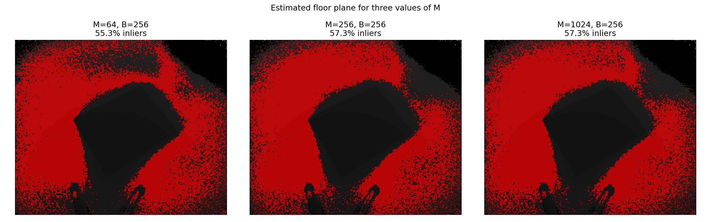
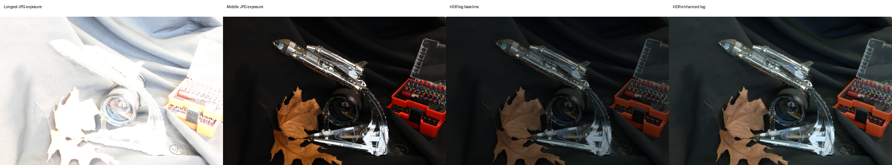
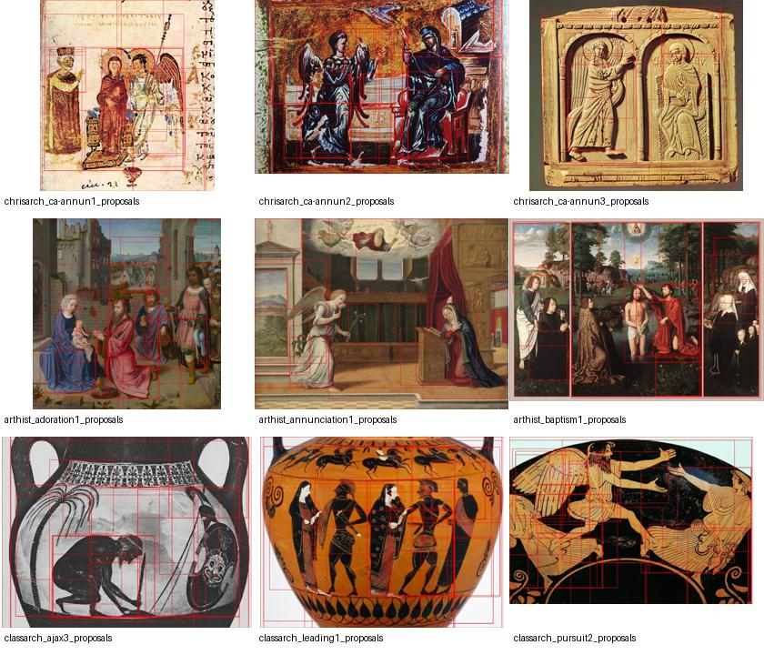

# Computer Vision

Five exercises from the Project Computer Vision course at FAU Erlangen-Nürnberg:
plane estimation, computational photography, writer retrieval, object detection
and face recognition. Each exercise includes code, a group component and an
individual extension, with reports and example results where available.

**Yasaman Piroozfar** · MSc Artificial Intelligence · Summer Semester 2026

## Exercises

| Exercise | Group component | Individual extension |
| --- | --- | --- |
| [01 · Plane detection](exercise-01-plane-detection/README.md) | RANSAC on Kinect point clouds; floor and box-top estimation | Residual-cost MLESAC and Preemptive RANSAC |
| [02 · Demosaicing and HDR](exercise-02-demosaicing-hdr/README.md) | Bayer demosaicing, white balance, RAW HDR and iCAM06 | Camera-response estimation and HDR from JPG exposures |
| [03 · Writer retrieval](exercise-03-writer-retrieval/README.md) | SIFT, VLAD and Exemplar SVM | PCA whitening and reciprocal query expansion |
| [04 · Object detection](exercise-04-object-detection/README.md) | Selective Search region proposals | Balloon detection with ResNet-18 features, SVM and NMS |
| [05 · Face recognition](exercise-05-face-recognition/README.md) | Face tracking, identification, clustering and DIR evaluation | Open-set learning with single and multiple pseudo-labels |

## Results

| Experiment | Result | Details |
| --- | --- | --- |
| Writer retrieval: VLAD + Exemplar SVM | Top-1 **87.86%**, mAP **0.7417** | [Experiment log](exercise-03-writer-retrieval/group/submitted_results/output.txt) |
| Writer retrieval: PCA 1024D + R-QE, k=4 | Top-1 **86.78%**, mAP **0.7481** | [Parameter study](exercise-03-writer-retrieval/individual/submitted_results/individual_exercise3_results.txt) |
| Balloon detection | AP@0.50 **0.3830**, mAP@0.50:0.95 **0.09161** | [Evaluation](exercise-04-object-detection/individual/submitted_results/balloon_pipeline/evaluation.json) |
| Face identification, full-video test | **1076/1080** known samples correct; **154/154** unknown samples rejected | [Report](exercise-05-face-recognition/group/reports/report.txt) |

### Plane estimation

### HDR from JPG exposures

### Selective Search

## Running the code

Each `group/` and `individual/` folder has its own README and `requirements.txt`.
Use a separate Python environment for each component and follow its setup commands.
The examples use Python 3.10 and Windows PowerShell.

Datasets and pretrained models are downloaded separately; see [data setup](docs/DATA.md)
for the required files and locations. Reports and example outputs are stored in
`reports/` and `submitted_results/`. New runs write to local output directories
excluded by `.gitignore`.

## Credits

Yasaman Piroozfar.
The exercises build on course assignments and starter code from FAU.
