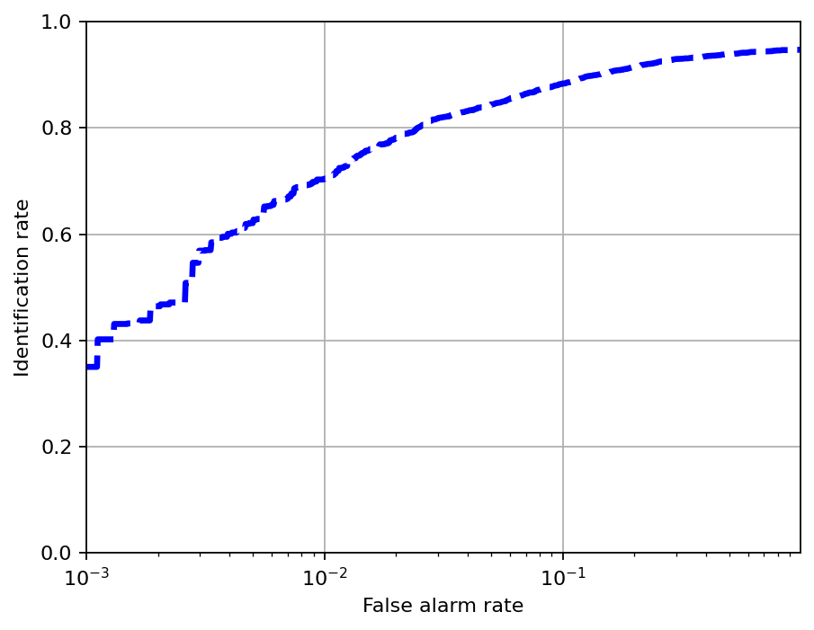

# Exercise 5 · Face recognition

The pipeline combines MTCNN detection, template tracking and crop/resize alignment
with 128-dimensional embeddings from `resnet50_128.onnx`. A custom k-NN classifier
identifies known faces and rejects unknown identities. A k-means implementation
supports clustering and re-identification.

## Setup

Place the image sequences, evaluation data and ONNX model in
[data/](data/README.md). Start PowerShell in this folder:

```powershell
py -3.10 -m venv .venv
$env:PYTHONNOUSERSITE = "1"
.\.venv\Scripts\python.exe -m pip install -r requirements.txt
$env:PYTHONPATH = (Resolve-Path ".\src").Path
```

Set `PYTHONPATH` again in each new terminal session. Run module commands from
this folder so that `src/cvproj_exc` and the data paths resolve correctly.

## Identification

Create a gallery with the first identity, then add the remaining identities
without `--reset`:

```powershell
.\.venv\Scripts\python.exe -m cvproj_exc.training --mode ident --reset --video ".\data\train_data\Alan_Ball\%04d.jpg" --label Alan_Ball
.\.venv\Scripts\python.exe -m cvproj_exc.training --mode ident --video ".\data\train_data\Marina_Silva\%04d.jpg" --label Marina_Silva
.\.venv\Scripts\python.exe -m cvproj_exc.training --mode ident --video ".\data\train_data\Manuel_Pellegrini\%04d.jpg" --label Manuel_Pellegrini
.\.venv\Scripts\python.exe -m cvproj_exc.training --mode ident --video ".\data\train_data\Nancy_Sinatra\%04d.jpg" --label Nancy_Sinatra
.\.venv\Scripts\python.exe -m cvproj_exc.training --mode ident --video ".\data\train_data\Peter_Gilmour\%04d.jpg" --label Peter_Gilmour
```

Test a known identity and an unknown identity:

```powershell
.\.venv\Scripts\python.exe -m cvproj_exc.test --mode ident --video ".\data\test_data\Alan_Ball\%04d.jpg"
.\.venv\Scripts\python.exe -m cvproj_exc.test --mode ident --video ".\data\test_data\Al_Pacino\%04d.jpg"
```

## Clustering and re-identification

```powershell
.\.venv\Scripts\python.exe -m cvproj_exc.training --mode cluster --reset --video ".\data\train_data\Alan_Ball\%04d.jpg"
.\.venv\Scripts\python.exe -m cvproj_exc.training --mode cluster --video ".\data\train_data\Marina_Silva\%04d.jpg"
.\.venv\Scripts\python.exe -m cvproj_exc.test --mode cluster --video ".\data\test_data\Marina_Silva\%04d.jpg"
.\.venv\Scripts\python.exe -m cvproj_exc.dir_curve
```

Image-sequence runs open an OpenCV window and require a graphical desktop.
Press ESC to close the visualization. Training saves gallery files in `data/`.

## Results

In the full-video identification test, 1,076 of 1,080 known samples were identified
correctly (99.63%), and all 154 unknown samples were rejected. The separate DIR
evaluation gives a rank-1 rate of 0.94717369.

The [report](reports/report.txt) covers template matching, threshold selection,
robustness, identification and clustering experiments.




[Exercise overview](../README.md) · [Project](../../README.md)
